# Refactoring Plan for `client/src/components/TournamentManagement.js`

This document outlines the plan to refactor the `TournamentManagement.js` component to improve code separation, readability, maintainability, and testability.

**Current State:**

The component manages multiple aspects of a tournament:
*   Entrants (CRUD, display)
*   Teams (CRUD, randomization, display)
*   Judges (CRUD, display)
*   APF Game Postings (CRUD, batch creation, status updates, reminders, display)
*   Standings (display, refresh)
*   Data fetching and state management for all entities.
*   UI state management (tabs, dialogs, notifications).
*   Rendering using Material UI.

**Problem:**

The file is over 2000 lines long, making it difficult to understand, modify, and test. Responsibilities are mixed, leading to high coupling.

**Refactoring Strategy:**

Break down the component using Custom Hooks for logic extraction and Sub-Components for UI rendering.

**1. Custom Hooks (Logic Extraction):**

*   **`useTournamentData(tournamentId)`:**
    *   Responsibility: Fetch core data (tournament, participants, teams, judges, postings, standings), manage main loading state, provide refresh functions.
    *   Returns: `{ tournament, entrants, teams, judges, postings, standings, loading, refetchStandings, refetchPostings, ... }`
*   **`useTournamentUIManager()`:**
    *   Responsibility: Manage UI state (tabs, notifications, potentially dialog visibility).
    *   Returns: `{ tabValue, handleTabChange, notification, showNotification, closeNotification, ... }`
*   **`useEntityManagement(tournamentId, initialData, apiEndpoints)` (or specific hooks like `useTeamManagement`, `useJudgeManagement`, `useEntrantManagement`):**
    *   Responsibility: Handle CRUD operations for entrants, teams, judges, manage related dialogs/forms, interact with API.
    *   Returns: `{ entities, openDialog, closeDialog, handleSubmit, handleDelete, dialogOpen, isEditing, currentItem, ... }`
*   **`useApfPostingManagement(tournamentId, teams, judges)`:**
    *   Responsibility: Handle APF posting logic (CRUD, batch create, status, reminders), manage `currentApfGameData`, interact with APF API endpoints.
    *   Returns: `{ apfPostings, loadingPostings, currentApfGameData, handleApfCardChange, handleConfirmApfGame, handleBatchCreate, handleStatusChange, handleSendReminder, handleEditPosting, handleDeletePosting, openApfDialog, closeApfDialog, ... }`

**2. Sub-Components (UI Rendering & Interaction):**

*   **`EntrantsTab`:** Displays entrants table/controls. Uses `useEntrantManagement`. Renders `EntrantDialog`.
*   **`TeamsTab`:** Displays teams table/controls. Uses `useTeamManagement`. Renders `TeamDialog`. Includes randomization logic (moved to hook).
*   **`JudgesTab`:** Displays judges table/controls. Uses `useJudgeManagement`. Renders `JudgeDialog`.
*   **`PostingTab`:** Displays APF card/list. Uses `useApfPostingManagement`. Renders `ApfGameDialog`.
*   **`StandingsTab`:** Displays standings table. Receives data/refresh function from `useTournamentData`.
*   **Dialog Components:** Extract `EntrantDialog`, `TeamDialog`, `JudgeDialog`, `ApfGameDialog`, `DeleteConfirmationDialog` into separate files.
*   **Shared Components:** `TabPanel`, `NotificationSnackbar` (consider context).

**3. Proposed Structure (Mermaid Diagram):**

```mermaid
graph TD
    TournamentManagement -- Manages Layout & Tabs --> useTournamentData(Hook: Fetch Core Data)
    TournamentManagement --> useTournamentUIManager(Hook: UI State - Tabs, Notifications)

    TournamentManagement --> EntrantsTab(Component)
    EntrantsTab --> useEntrantManagement(Hook: Entrant CRUD)
    EntrantsTab --> EntrantDialog(Component)
    EntrantsTab --> DeleteConfirmationDialog(Component)

    TournamentManagement --> TeamsTab(Component)
    TeamsTab --> useTeamManagement(Hook: Team CRUD & Randomize)
    TeamsTab --> TeamDialog(Component)
    TeamsTab --> DeleteConfirmationDialog(Component)

    TournamentManagement --> JudgesTab(Component)
    JudgesTab --> useJudgeManagement(Hook: Judge CRUD)
    JudgesTab --> JudgeDialog(Component)
    JudgesTab --> DeleteConfirmationDialog(Component)

    TournamentManagement --> PostingTab(Component)
    PostingTab --> useApfPostingManagement(Hook: APF CRUD & Logic)
    PostingTab --> EnhancedApfPostingCard(Component)
    PostingTab --> ApfPostingList(Component)
    PostingTab --> ApfGameDialog(Component)
    PostingTab --> DeleteConfirmationDialog(Component)

    TournamentManagement --> StandingsTab(Component)

    subgraph Hooks
        useTournamentData
        useTournamentUIManager
        useEntrantManagement
        useTeamManagement
        useJudgeManagement
        useApfPostingManagement
    end

    subgraph Components
        TournamentManagement
        EntrantsTab
        TeamsTab
        JudgesTab
        PostingTab
        StandingsTab
        EntrantDialog
        TeamDialog
        JudgeDialog
        ApfGameDialog
        DeleteConfirmationDialog
        EnhancedApfPostingCard
        ApfPostingList
        TabPanel
        NotificationSnackbar
    end

    %% Data Flow Examples
    useTournamentData -- Entrants Data --> EntrantsTab
    useTournamentData -- Teams Data --> TeamsTab
    useTournamentData -- Judges Data --> JudgesTab
    useTournamentData -- Postings Data --> useApfPostingManagement
    useTournamentData -- Standings Data --> StandingsTab

    useTournamentUIManager -- Tab Value --> TournamentManagement
    useTournamentUIManager -- Notification State --> NotificationSnackbar

    EntrantsTab -- Calls Add/Edit/Delete --> useEntrantManagement
    TeamsTab -- Calls Add/Edit/Delete/Randomize --> useTeamManagement
    JudgesTab -- Calls Add/Edit/Delete --> useJudgeManagement
    PostingTab -- Calls APF Actions --> useApfPostingManagement
```

**Benefits:**

*   Improved Readability
*   Enhanced Maintainability
*   Better Testability
*   Potential for Reusability